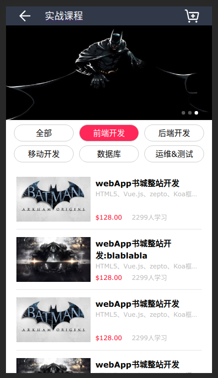

# TW-homeworks

A repo to store my homeworks

## Task Week1-01-02 HTML 实战

成果链接: <https://edwardlin-zlt.github.io/TW-homeworks/Week01/01-02_HTML实战/UML_testing.html>

## Task Week1-02-02 添加背景音乐

成果链接: <https://edwardlin-zlt.github.io/TW-homeworks/Week01/01-02_HTML实战/UML_testing_with_bgmusic.html>

## Task Week1-03-02 仿制

成果链接: <https://edwardlin-zlt.github.io/TW-homeworks/Week01/03-02_CSS基础一/0302.html>

## Task Week1-04-01 HTML 布局

两列布局成果页面: <https://edwardlin-zlt.github.io/TW-homeworks/Week01/04-01_CSS基础二/0401_two_col.html>

三列布局成果页面: <https://edwardlin-zlt.github.io/TW-homeworks/Week01/04-01_CSS基础二/0401_three_col_2.html>

## Task Week1-04-02 移动端网页仿制

### 成果预览:

成果链接: <https://edwardlin-zlt.github.io/TW-homeworks/Week01/04-02_CSS基础二/mobile.html>

## Task Week1-05 CSS 基础

成果链接: <https://edwardlin-zlt.github.io/TW-homeworks/Week01/05-02_CSS%E5%9F%BA%E7%A1%80/0502.html>

## Task Week1-06 HTML 大作业

成果链接： <https://edwardlin-zlt.github.io/TW-homeworks/Week01/06_%E9%A1%B9%E7%9B%AE%E5%AE%9E%E8%B7%B5/index.html>
